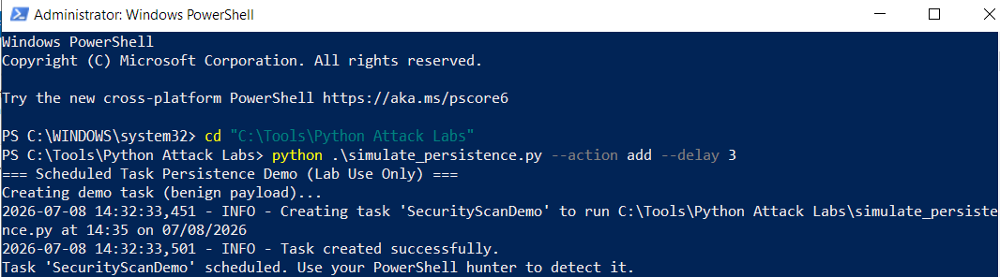
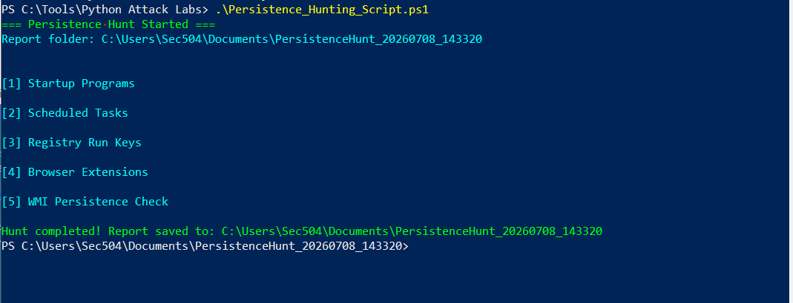
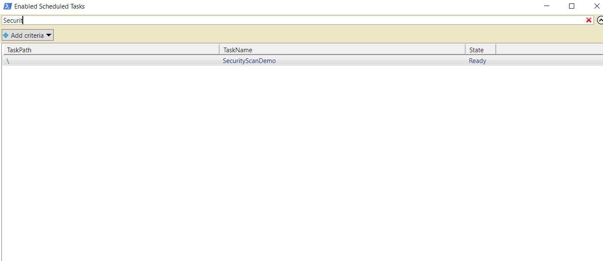
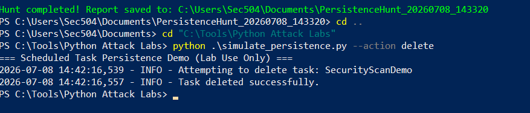

# Persistence Techniques - Scheduled Tasks (T1053.005)

This project demonstrates the **Persistence** tactic using Windows Scheduled Tasks. It includes a modernized Python script that safely creates, enumerates, and deletes a demo scheduled task in an isolated lab environment.

**MITRE ATT&CK Mapping**  
**Tactic**: Persistence
**MITRE ATT&CK Technique:** T1053.005 - Scheduled Task

**Author:** B. Underhill  
**Date:** July 2026  

---

## Ethical Disclaimer

**For Educational and Authorized Use Only**

This code is provided strictly for learning purposes in controlled, isolated lab environments (e.g., personal VMs). 

- Do **not** use this code on any unauthorized systems.
- Unauthorized use may violate laws and ethical standards.
- Always obtain explicit written permission before testing on any non-lab systems.

The author and contributors bear no responsibility for misuse.

---

## Description

The script allows safe simulation of scheduled task persistence:
- Create a benign scheduled task (one-time execution after a configurable delay).
- Enumerate existing tasks.
- Clean up (delete) the demo task.

This pairs with the defensive PowerShell script `Persistence_Hunting_Script.ps1` to demonstrate both offensive implementation and detection.

---

## Features

- Secure command execution using `subprocess` (avoids dangerous `os.system`).
- Command-line interface with `argparse`.
- Comprehensive logging.
- Error handling and Windows-specific checks.
- Reversible and lab-safe design.

---

## Prerequisites

- Windows VM (e.g., SEC504 lab environment)
- Python 3.x
- Administrator privileges (required to create SYSTEM tasks)
- Isolated lab environment with snapshots enabled

---

## Usage

Run from an **Administrator** PowerShell prompt:

```powershell
# Create demo task (runs in ~3 minutes)
python simulate_persistence.py --action add --delay 3

# Check for the task
python simulate_persistence.py --action enumerate

# Delete the task
python simulate_persistence.py --action delete

```

## Lab Testing Notes
- Tested in isolated SEC504 VM.
- Task SecurityScanDemo successfully created and detected by the PowerShell hunter. 
- Full cleanup verified. 
- Snapshots used before/after testing for safety.
  








## Learning Outcomes
- Understanding of MITRE ATT&CK Persistence tactic (T1053.005).
- Modernization of legacy course code into professional, secure Python.
- Practical red team / blue team workflow using Python + PowerShell.
- Importance of proper permissions, logging, and reversible lab techniques.

## Attribution & Acknowledgments
- Base concepts and code examples are from the Python for Cybersecurity Specialization on Coursera (2020) by Howard Poston.
- Code was significantly modernized, restructured, and enhanced with help from Grok (xAI).
- All final implementation, testing, documentation, and enhancements are my own.
