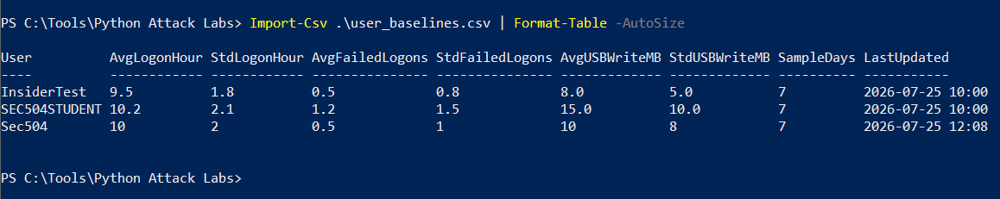
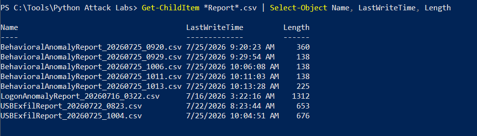
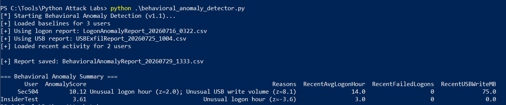
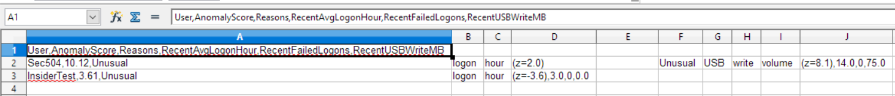

# Behavioral Anomaly Detection (UEBA-lite)

This component demonstrates a simple **behavioral analytics** approach to insider threat detection.  
Instead of relying only on fixed rules (e.g. “any USB write over 10 MB is bad”), it compares current activity against each user’s historical baseline and calculates how unusual the behavior is.

## Key Concept

| Approach | How it works |
|----------|--------------|
| Rule-based (previous scripts) | Fixed thresholds applied to everyone |
| Behavioral (this script) | Per-user baselines + statistical deviation (z-score) |

## Metrics Used

- Average logon hour
- Failed logon count
- USB / removable media write volume (MB)

## Lab Testing (SANS SEC504 Windows 10)

### Step 1 – Per-user baselines
We maintain a simple baseline file that stores each user’s normal behavior.

  
*Per-user baselines used by the behavioral detector*

### Step 2 – Available activity reports
The detector consumes the latest reports produced by the PowerShell detection scripts.

  
*Available Logon and USB reports*

### Step 3 – Running the detector
```powershell
python behavioral_anomaly_detector.py
```

  
*Behavioral Anomaly Detector execution and scored summary*

### Step 4 – Results
The script produces a ranked report of users ordered by anomaly score.

  
*Final anomaly scores*

**Interpretation of results:**
- **Sec504** (Score 10.12) – Strong anomaly driven by unusual logon hour + very high USB write volume (75 MB vs baseline ~10 MB).
- **InsiderTest** (Score 3.61) – Clear off-hours logon anomaly.

This shows the value of behavioral detection: the same USB volume would be evaluated differently depending on the user’s normal pattern.

## MITRE ATT&CK Mapping

- T1078 – Valid Accounts  
- T1052 – Exfiltration Over Physical Medium  
- T1110 – Brute Force  

## Limitations (intentionally simple for portfolio)

- Baselines are currently maintained manually
- Uses basic z-score statistics (no machine learning)
- Designed for clarity and educational value rather than production scale

## Ethical Disclaimer
For authorized lab and educational use only. Unauthorized use is prohibited.

---
*Part of the infosec-portfolio – PowerShell + Python defensive tooling.*
